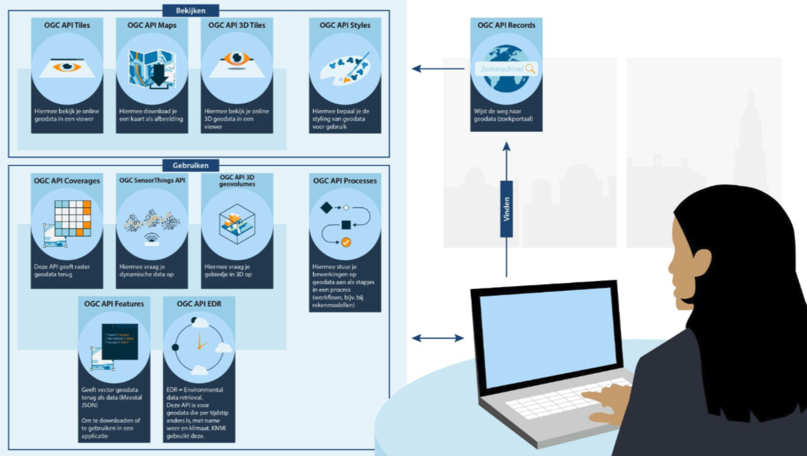

# Van WCS naar OGC API - Coverages 

Raster- en multidimensionale datasets werden vroeger beschikbaar gesteld via de OGC Web Coverage Service (WCS). Een typische WCS-aanvraag zag er zo uit: 

> ```Client → GetCapabilities → DescribeCoverage → GetCoverage → GeoTIFF ```

De moderne vervanger is OGC API - Coverages. Die biedt RESTful toegang tot coverage-resources en ondersteunt formaten als GeoTIFF en NetCDF. OGC API Coverages is onderdeel van de OGC Rest API standaarden.

- De OpenAPI specificatie geeft alle collecties weer (GetCapabilities)
- /collections/{id} geeft informatie over de betreffende collectie (DescribeCoverage)
- /collections/{id}/coverage geeft het desbetreffende coverage (GetCoverage)

OGC API - Coverages is de logische, op standaarden gebaseerde doorontwikkeling van WCS. 

## Data vinden, gebruiken en bekijken

Er zijn verschillende soorten OGC API's voor verschillende soorten gebruik.

Deze handreiking gaat vooral in op de API's voor vinden en gebruiken van Rasterdata. Daarnaast zijn er ook API's voor het bekijken (Visualiseren).

