# OGC API Coverages, COG/Zarr, STAC en OGC API Records in perspectief 

STAC, OGC API Coverages en OGC API Records lijken op het eerste gezicht concurrenten. In de praktijk lossen ze elk een ander probleem op en werken ze het best samen. 

## DCAT / ISO-19115 

Op het hoogste niveau is er de datasetcatalogus. Die beantwoordt vragen als: welke datasets zijn beschikbaar, wie publiceert ze, onder welke licentie zijn ze te gebruiken, en welke services en downloads zijn er? 

Dit is het domein van DCAT-AP-NL, het Nederlandse profiel voor ISO-19115 en het Nationaal Georegister. Voorbeelden van datasets op dit niveau: 

  - AHN5
  - BRO Model Grondwaterspiegeldiepte
  - BGT 
  - BRP 
  - Nationaal Klimaatdataset 

## STAC (metadatamodel) 

Één niveau lager zit de assetcatalogus. Die beantwoordt vragen als: welke AHN-tegel bevat Amsterdam, welke Sentinel-scène dekt mijn gebied, en welk klimaatmodelresultaat hoort bij dit scenario? 

Voorbeelden van assets op dit niveau: 

  - AHN Tegel 32EZ1 
  - Sentinel Scène 2026-06-15 
  - BRO WDM Grid 
  - Klimaatmodelrun 42 

STAC is daarmee een aanvulling op DCAT, geen vervanging. 

## OGC API Coverages 

OGC API Coverages heeft een andere positie in de architectuur. In plaats van datasets of assets te catalogiseren, biedt het een gestandaardiseerde interface voor toegang tot en verwerking van coverages. Typische mogelijkheden: 

- Coverage ophalen 
- Ruimtelijk subsetten 
- Dimensionaal snijden 
- CRS-transformaties, herprojektie en resampling 

Anders dan STAC biedt OGC API Coverages een operationele toegangsinterface. 

## Cloud-native en service-georiënteerde toegang naast elkaar 

__Cloud-native toegang:__

```STAC Item → COG / Zarr → Client haalt data op via HTTP Range requests```

__Service-georiënteerde toegang:__ 

```DCAT Dataservice → OGC API Coverages → Server serveert data naar de Client ```

Beide patronen kunnen naast elkaar bestaan en zelfs dezelfde onderliggende dataset ontsluiten: 

AHN Dataset 
  - STAC + COG 
  - OGC API Coverages 

Klimaatmodel 
  - STAC + Zarr 
  - OGC API Coverages 

## Een gelaagde architectuur 

Deze technologieën zijn het krachtigst wanneer je ze combineert in één architectuur: 




In deze architectuur: 

Bieden ISO-19115 / DCAT gezaghebbende datasetmetadata. 

Verzorgt STAC ontdekking op assetniveau. 

Bieden COG en Zarr cloud-native opslag. 

Biedt OGC API Coverages op standaarden gebaseerde servicetoegang en server-side verwerkingsmogelijkheden. 

Deze technologieën zijn geen alternatieven voor elkaar. Ze bedienen elk een andere laag van een moderne geo-architectuur en zijn het effectiefst wanneer je ze samen inzet. 

## Wanneer voegt OGC API - Coverages waarde toe? 

Ondanks de kracht van STAC en COG zijn sommige toepassingen bij uitstek geschikt voor OGC API - Coverages. 

### Multidimensionale datacubes 

Voorbeelden: weersvoorspellingen, klimaatsimulaties, luchtkwaliteitsmodellen, hydrologische simulaties en Digital Twin-simulaties. 

Dimensies kunnen zijn: x, y, z, tijd, scenario. 

Dit zijn echte coverage-datasets, geen verzamelingen statische rasters. Coverage-API's bieden expliciete ondersteuning voor dimensionaal snijden en coverage-semantiek. 

### Server-side herprojektie 

OGC API - Coverages voert herprojektie uit op de server: 

Invoer-CRS: EPSG:28992 → Uitvoer-CRS: EPSG:4326 

Clients hoeven dit niet zelf te doen. 

### Interpolatie en resampling 

Coverage-services ondersteunen server-side bewerkingen zoals nearest neighbour, bilineaire interpolatie en kubische interpolatie. Dit is een erfenis uit het WCS-ecosysteem en blijft een belangrijke kracht van coverage-services. 

## OGC API EDR: een lichtgewicht alternatief 

Naast OGC API Coverages en Zarr is er een derde optie voor multidimensionale omgevingsdata: OGC API Environmental Data Retrieval (EDR). EDR biedt een familie van lichtgewichte interfaces voor toegang tot ruimtelijk-temporele omgevingsdata. De standaard is goedgekeurd door het OGC en beschikbaar in versie 1.1. 

Waar OGC API Coverages gericht is op volledige coverage-subsetting, richt EDR zich op gerichte queries op specifieke locaties, routes of gebieden. EDR ondersteunt de volgende querypatronen: 

- Position: geef de waarden op een specifiek punt. 
- Radius: geef de waarden binnen een straal rondom een punt. 
- Area: geef de waarden binnen een polygoon. 
- Cube: geef de waarden binnen een 3D-blok. 
- Trajectory: geef de waarden langs een route. 
- Corridor: geef de waarden in een strook langs een route. 

EDR is daarmee bij uitstek geschikt voor operationele toepassingen. Denk aan: 
- "wat is de windsnelheid op coördinaat X?", 
- "wat zijn de luchtkwaliteitswaarden langs deze rijksweg?" of 
- "geef mij de watertemperatuur op dit meetpunt voor de afgelopen 7 dagen". 

## Vergelijking: OGC API EDR, OGC API Coverages en Zarr 

De drie opties bedienen elk een ander gebruik. Hieronder een overzicht van de belangrijkste verschillen: 

|Kenmerk |           OGC API EDR  |      OGC API Coverages  | Zarr |
| --- | --- | --- | --- |
|Type        |   API         |        API          |        Opslagformaat |
|Focus        |        Locatiequery |       Coverage-subsetting  | Directe opslag  |
|Verwerking    |       Server-side   |      Server-side     |     Client-side |
|Complexiteit   |      Laag        |        Hoog          |       Gemiddeld |
|Geschikt voor   | Operationele data en real-time  |  Wetenschappelijke datacubes |   Grootschalige analyse |
|Querypatronen   | Punt, lijn, gebied, kubus | Dimensionaal snijden, subset | Niet van toepassing |
|Ecosysteem     |      Volwassen    |       Nog in ontwikkeling | Volwassen |

### Voordelen van OGC API EDR 

- Eenvoudig te implementeren en te gebruiken. 
- Lichtgewicht: ideaal voor gerichte locatiequeries. 
- Goede ondersteuning voor trajectories en corridors. 
- Geschikt voor real-time en operationele omgevingsdata. 
- Volwassener ecosysteem dan OGC API Coverages. 
- Ondersteunt CoverageJSON als uitvoerformaat. 

### Nadelen van OGC API EDR 

- Minder geschikt voor grote raster-downloads of volledige coverage-subsetting. 
- Geen volledige ondersteuning voor CRS-transformaties en resampling. 
- Minder geschikt voor complexe wetenschappelijke datacubes. 
- Voert geen server-side interpolatie of herprojektie uit. 

## Wanneer kies je voor welke optie? 

De keuze hangt af van de toepassing en de gebruiker: 

- __OGC API EDR:__ kies dit voor operationele omgevingsdata en eenvoudige locatiegebaseerde queries. Denk aan weerstoepassingen, luchtkwaliteitsmonitoring en real-time sensordata. 

- __OGC API Coverages:__ kies dit voor volledige coverage-subsetting, CRS-transformaties en complexe multidimensionale datacubes. Dit is de meest complete opvolger van WCS. 

- __Zarr:__ kies dit wanneer data scientists direct en grootschalig toegang nodig hebben. Zarr werkt het best in combinatie met Python-tools als xarray en Dask, zonder server-side middleware. 

In de praktijk kunnen alle 3 naast elkaar bestaan op dezelfde dataset: 

Klimaatmodel 
  - OGC API EDR         → Locatiequery's voor operationeel gebruik 
  - OGC API Coverages   → Subsetting en herprojektie voor GIS-gebruikers 
  - Zarr                → Grootschalige analyse voor data scientists 
  ​
## Clientondersteuning: QGIS en ArcGIS 

De sterkste clientondersteuning bestaat voor STAC + COG. Desktop GIS-producten en geo-bibliotheken hebben al volwassen ondersteuning voor HTTP range requests, Cloud Optimized GeoTIFFs, STAC-catalogi en GDAL-gebaseerde rastertoegang. 

QGIS kan efficiënt datasets ontdekken via STAC, COG's direct lezen en alleen de benodigde rasterblokken laden. 

ArcGIS biedt vergelijkbare ondersteuning voor STAC-catalogi, cloud-native rasters en imageservices. 

## OGC API - Coverages adoptie 

OGC API - Coverages is de conceptuele opvolger van WCS. De clientondersteuning is echter nog minder volwassen dan voor STAC, COG, WMS, WCS en WMTS. De specificatie is solide, maar het ecosysteem is nog volop in ontwikkeling. 

## DCAT en STAC koppelen

Aanbevolen patroon 

Behandel de STAC API als een distributie of service van een DCAT-dataset: 

DCAT Dataset: 
  - OGC API Features 
  - OGC API Coverages 
  - Downloadservice 
  - STAC API 

Het DCAT-record bevat een link naar het STAC-eindpunt. De STAC Collection linkt terug met de relatie describedby, die verwijst naar het gezaghebbende DCAT-record. Zo ontstaat bidirectionele navigatie: 

DCAT Dataset ↔ STAC Collection 

### Voorbeeld DCAT-patroon 

```turtle
ex:ahn5 
    a dcat:Dataset ; 
    dct:title "AHN5"@nl ; 
    dcat:distribution ex:ahn5-stac . 
ex:ahn5-stac 
    a dcat:Distribution ; 
    dct:title "AHN5 STAC API"@en ; 
    dcat:accessURL <https://api.example.nl/stac/> ; 
    dct:format "application/json" . 
```

Voorbeeld STAC-backlink 
```json
{ 
  "id": "ahn5-dsm", 
  "type": "Collection", 
  "links": [ 
    { 
      "rel": "describedby", 
      "href": "https://data.example.nl/datasets/ahn5", 
      "type": "text/html", 
      "title": "Gezaghebbend DCAT-metadatarecord voor AHN5" 
    } 
  ] 
} 
```

# Conclusie 

De geo-wereld convergeert naar een complementaire, gelaagde architectuur: 

- DCAT/ISO 19115 voor gezaghebbende datasetcatalogisering. 
- STAC voor cloud-native assetontdekking. 
- COG voor efficiënte rasteropslag en directe toegang. 
- OGC API - Coverages voor op standaarden gebaseerd subsetten en multidimensionale coveragetoegang. 

## Voor statische rasterproducten 

Voorbeelden: AHN, orthofoto's, satellietarchieven 

Aanbeveling: STAC + COG 

## Voor dynamische en/of multidimensionale data 

Voorbeelden: klimaatprojecties, hydrologische modellen, luchtkwaliteitssimulaties, Digital Twin-simulatie-uitvoer 

Aanbeveling: STAC + OGC API Coverages of STAC + OGC API Coverages + Zarr, afhankelijk van de analytische vereisten. 

Voor operationele locatiegebaseerde queries is OGC API EDR een lichtgewicht en volwassen alternatief dat goed naast OGC API Coverages en Zarr ingezet kan worden. 

Voor de meeste huidige rastercases – zeker Earth Observation-archieven en nationale basissets – biedt STAC + COG de beste ecosysteemondersteuning en clientinteroperabiliteit. 

Voor geavanceerde multidimensionale Digital Twin-, klimaat-, hydrologische en simulatiedatasets blijft OGC API - Coverages de meest complete, op standaarden gebaseerde opvolger van WCS en biedt het mogelijkheden die STAC en COG alleen niet volledig kunnen invullen. 

# Overzicht standaarden 

Metadata-API-laag:
- OGC API Records 
- STAC API 

Metadatamodellaag:
- DCAT (DCAT-AP / DCAT-AP-NL)
- STAC 
- ISO 19115 (Nederlands profiel op ISO 19115/19119)
- GeoDCAT-AP 

Datatoegangslaag: 
- OGC API Coverages 
- OGC API EDR 
- OGC API Features 
- OGC API Tiles 

Opslaglaag:
- COG 
- Zarr 
- Parquet 
- NetCDF 